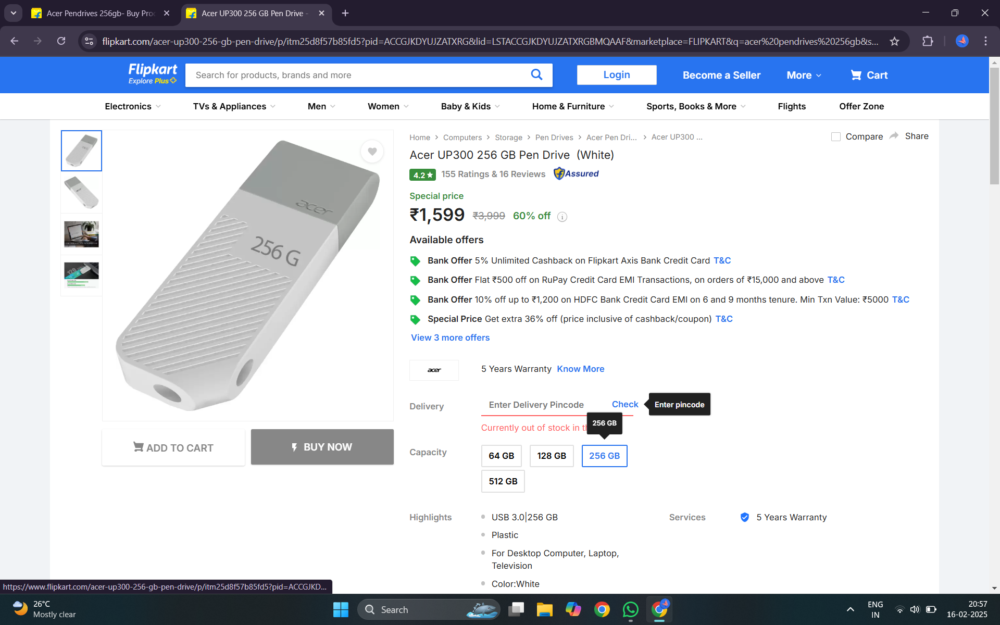

# heading 1
## heading 2
### heading 3
#### heading 4
##### heading 5

**bold text**  __bold__

*italic text*  _italic text_

***bold+italic*** ___bold+italic___  
~~strikethrough~~

This is a first line   
this is a second line

this a first line in paragraph 1   

this is second line in paragraph 2  

### table
|s no|name| marks|
|---|---|---|
1|pavan nikhil |100
2|puneeth|400
3 |tarunkumar|100
4|krishna keerthi|100
5|swetha|100

### table with alignment 
|sno|name|pin|
|:---|:---:|---:| 
1|pavan nikhil|019
2|puneeth|038|
3|tarunkumar|054
4|krishna keerthi |046
5|swetha |060

|sno|name|pin|
|:---|:---:|---:| 
123456|pavan nikhil|123456
123456|puneeth|123456
123456|tarunkumar|123456
123456|krishna keerthi |123456
123456|swetha |123456

//:-- stands for left alignment  
//:---: stands for centre alignemnt
//---: stands for right alignment

>blockquotes

- bullet1
- bullet2  
    - subitem
    - subitem2  
- 
  
### ordered list type 1
1. nikhil  
2. puneeth  
3. tarun
4. keerthi
5. swetha       

### ordered list type 2
1. nikhil
7. puneeth
3. tarun
4. keerthi
8. swetha

### link
[youtube](https://youtube.com)

### automatic url linking
https://youtube.com  
//even if you dont wrap it in [text](link) it works as a clickable link

### disable automatic url linking 
`https://youtube.com `  
// this link is not clickable 

### image to link linking

//if you click the image the link will open

>tarun sekharamahanthi block quote  
>>tarun sekharamahanthi subblock quote  
tarun sekharamahanthi block quote

### horizontal line
---
or
***
or
___

### footnotes
hello this is my first important point.   
[^1]This is a statement with a footnote.[^1]  
// preview doesnt work in vs code need to install markdown preview extension

### definiton

vs code  
: vs code is a very powerful  
// definiton doesnt work in vs code need to install markdown preview extension

### tasks/checkboxes
- [ ] unticked check box
- [x] ticked check box

### pending  
- [ ] fenced code blocks  
- [ ] syntax highlighting
