# VLSI
### AND GATE USING CMOS

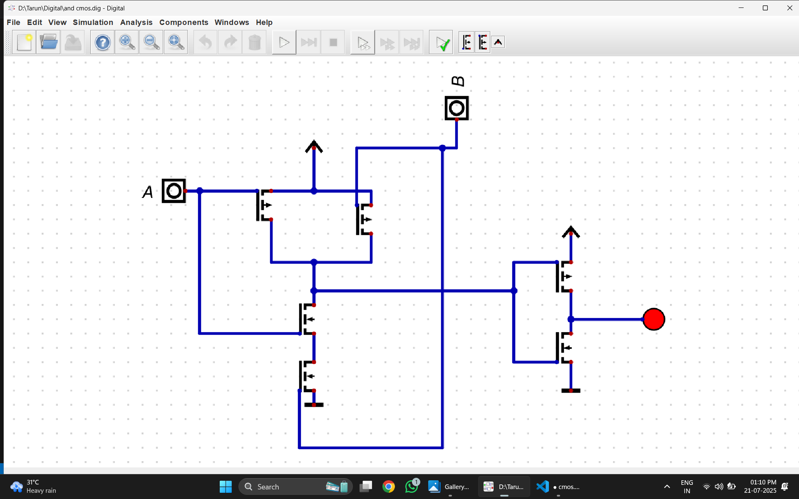

EQ:A.B
### Truth Table 
|input|input|output|
|-----|--|---|
|a|b|out|
|0|0|0
0|1|0
1|0|0
1|1|1

## *OR GATE USING CMOS*
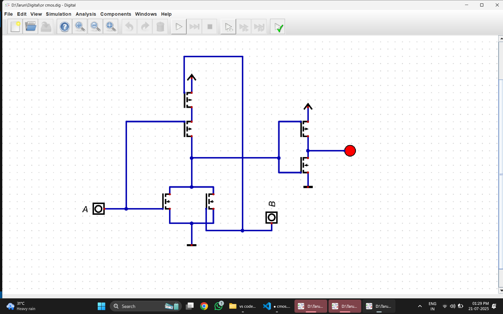
EQ:A+B
### Truth Table
|input|input|output
|-|-|-
a|b|out
0|0|0
0|1|1
1|0|1
1|1|1

## not gate

EQ:A=A'
## Truth Table
input|output
--|--
a|out
0|1
1|0

## nand
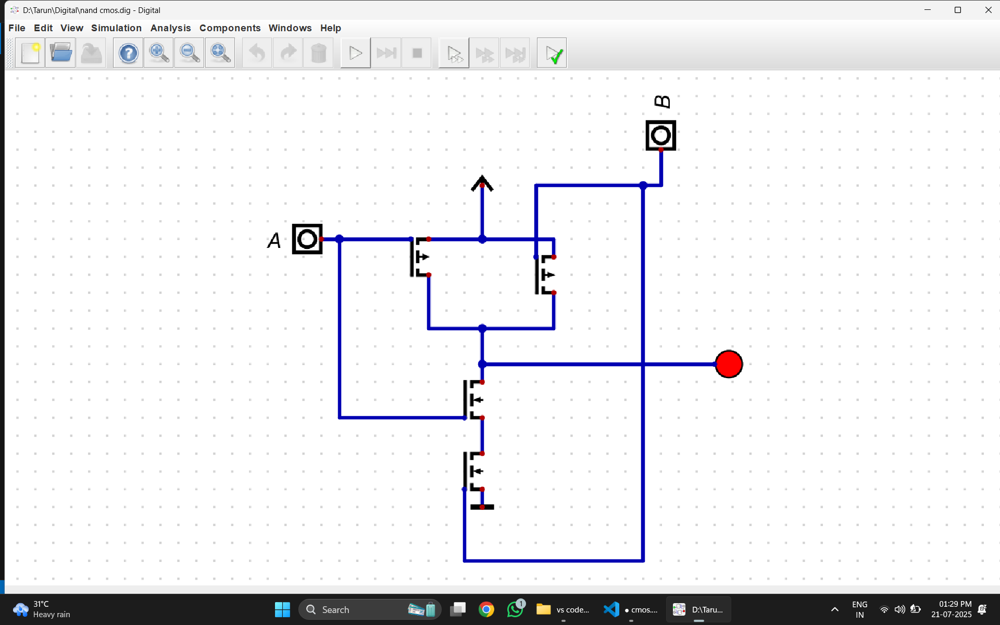
EQ:A'.B'
### Truth Table
|Input|Input|Output
---|---|--
a|b|out
0|0|1
0|1|1
1|0|1
1|1|0

## NOR
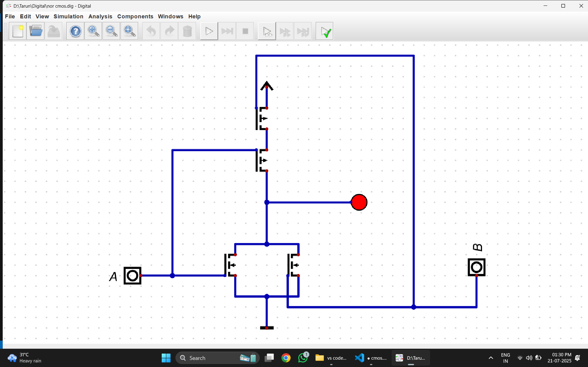
EQ:A'+B'
### Truth TAble
|Input|Input|Output
|--|--|--
a|b|out
|0|0|1
|0|1|0
|1|0|0
|1|1|0

## xor
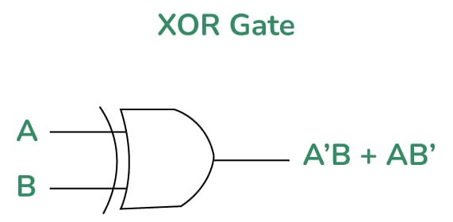
### Truth table
|Input|Input|Output
|--|--|-
|0|0|0
0|1|1
1|0|1
1|1|0

## xnor
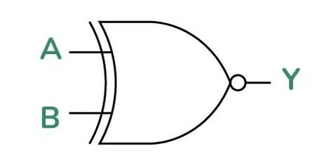
### Truth table
|Input|Input|Output
|--|--|-
|0|0|1
0|1|0
1|0|0
1|1|1

## SRFF

### Truth table
|S|R|Q|Q'|
|--|--|--|-
|0|0|NC|NC
0|1|0|1
1|0|1|0
1|1|X|X
 ### characteristic Table
|S|R|present|QN+1(next)
|--|--|--|--
|0|0|0|0
|0|0|1|1
|0|1|0|0
|0|1|1|0
|1|0|0|1
|1|0|1|1
|1|1|0|X
|1|1|1|X

## JKFF
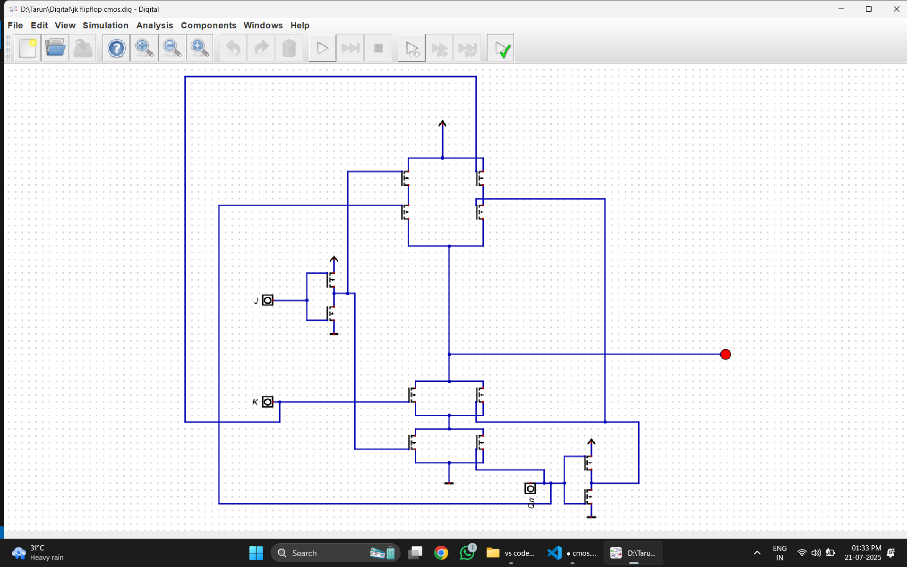
### Truth table
|J|K|Q|Q'|OPERATION
|--|--|--|--|--
|0|0|NC|NC|NC
0|1|0|1|RESET
1|0|1|0|SET
1|1|QN'|QN|TOGGLE
### characteristic Table
|J|K|QN|QN+1
|--|--|--|--
|0|0|0|0
|0|0|1|1
|0|1|0|0
|0|1|1|0
|1|0|0|1
|1|0|1|1
|1|1|0|1
|1|1|1|0

## DFF

### Truth table
|D|Q|Q'
|--|--|-
|0|0|1
0|1|0
### Characteristic Table
|D|QN|QN+1
|--|--|--
|0|0|0
|0|1|0
|1|0|1
|1|1|1

## TFF
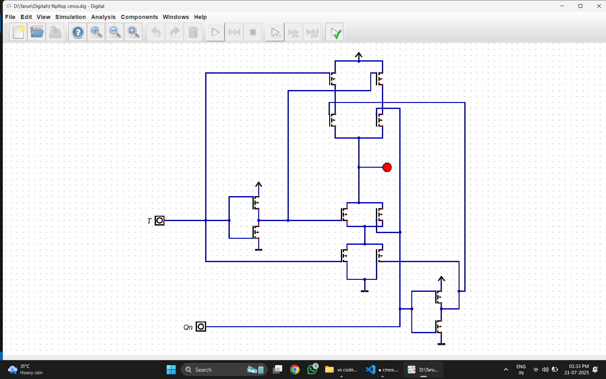
### Truth table
|T|QN|Q^N+1
|--|--|-
|0|0|0
0|1|1
1|0|1
1|1|0 
### Characteristic Table
|T|QN|QN+1
|--|--|--
|0|0|0
|0|1|1
|1|0|1
|1|1|0

## MUX 
### MUX 2-1
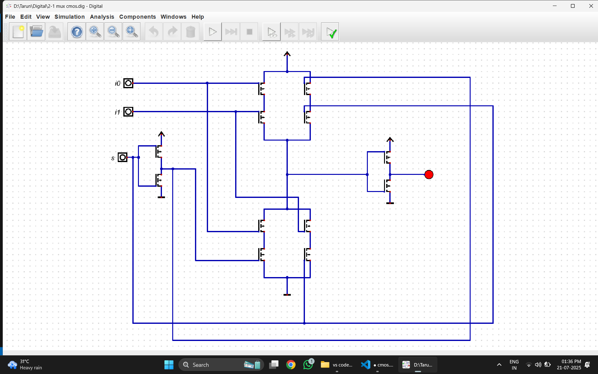

### Truth table
|S|Y
|--|-
0|i0
1|i1

### MUX 4-1
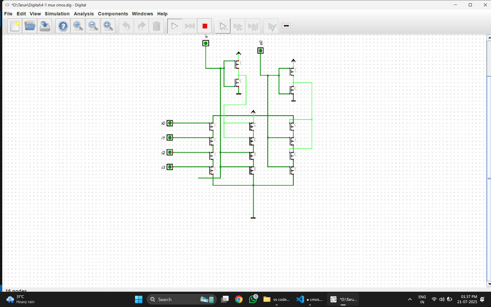

### Truth table
|S0|S1|Y
|--|--|-
|0|0|i0
0|1|i1
1|0|i2
1|1|i3

## DEMUX

### Truth Table
|Data|s1|s0|i0|i1|i2|i3
|---|--|--|--|--|--|--|
|1|0|0|1|0|0|0
|1|0|1|0|1|0|0
|1|1|0|0|0|1|0
1|1|1|0|0|0|1

## ENCODERS

### 4-to-2 Encoder
   

   ##### Truth table

   | D0 | D1 | D2 | D3 | Y0 | Y1 |
   |----|----|----|----|----|----|
   | 1  | 0  | 0  | 0  | 0  | 0  |
   | 0  | 1  | 0  | 0  | 0  | 1  |
   | 0  | 0  | 1  | 0  | 1  | 0  |
    | 0  | 0  | 0  | 1  | 1  | 1  |

 ### 8-to-3 Encoder 
    
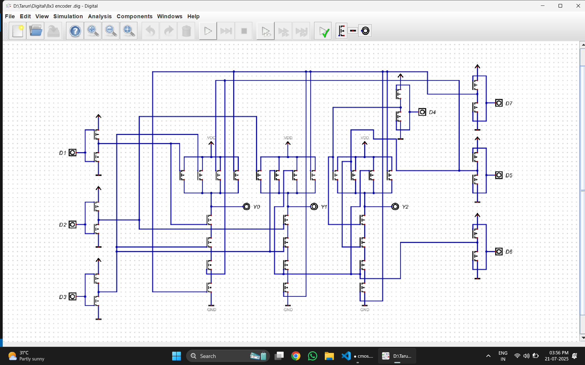

### Truth table 

| D₇ | D₆ | D₅ | D₄ | D₃ | D₂ | D₁ | D₀ | Y₂ | Y₁ | Y₀ |
| -- | -- | -- | -- | -- | -- | -- | -- | -- | -- | -- |
| 0  | 0  | 0  | 0  | 0  | 0  | 0  | 1  | 0  | 0  | 0  |
| 0  | 0  | 0  | 0  | 0  | 0  | 1  | 0  | 0  | 0  | 1  |
| 0  | 0  | 0  | 0  | 0  | 1  | 0  | 0  | 0  | 1  | 0  |
| 0  | 0  | 0  | 0  | 1  | 0  | 0  | 0  | 0  | 1  | 1  |
| 0  | 0  | 0  | 1  | 0  | 0  | 0  | 0  | 1  | 0  | 0  |
| 0  | 0  | 1  | 0  | 0  | 0  | 0  | 0  | 1  | 0  | 1  |
| 0  | 1  | 0  | 0  | 0  | 0  | 0  | 0  | 1  | 1  | 0  |
| 1  | 0  | 0  | 0  | 0  | 0  | 0  | 0  | 1  | 1  | 1  |

### 2 TO 4 Decoder 
   
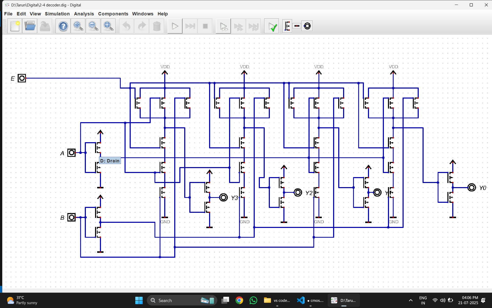

### Truth table 

|E (Enable)|A|B|D0|D1|D2|D3|
|--| ------ | ------ | ------ | ------ | ------ | ------ |
| 1 | 0| 0| 1| 0 | 0 | 0 |
| 1 | 0| 1| 0| 1 | 0 | 0 |
| 1 | 1| 0| 0| 0 | 1 | 0 |
| 1 | 1| 1| 0| 0| 0| 1|

### ALU 

