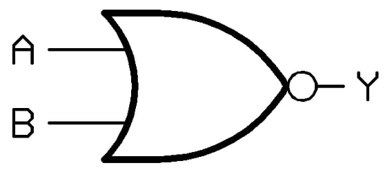

## ***AND GATE***

### Truth Table 
|input|input|output|
|-----|--|---|
|a|b|out|
|0|0|0
0|1|0
1|0|0
1|1|1

### Timing Diagram
```wavedrom
{signal:  [
   { name: "a",wave: "0.1.",period :"1"},
   {name: "b",wave: "0101"},
   {name: "out",wave: "0..1"}
]}
```

## ***OR GATE***


### Truth Table
|input|input|output
|-|-|-
a|b|out
0|0|0
0|1|1
1|0|1
1|1|1

### Timing diagram 
```wavedrom

{signal: [
{name: "a",wave: "0.1."},
{name: "b",wave: "0101"},
{name: "out",wave: "01.."}
]}
```

## not gate


## Truth Table
input|output
--|--
a|out
0|1
1|0

## Timing diagram
```wavedrom
{signal: [
   {name: "a",wave:"01010101"},
   {name: "out",wave:"10101010"}
]}
```

## nand


### Truth Table
|Input|Input|Output
---|---|--
a|b|out
0|0|1
0|1|1
1|0|1
1|1|0

### timing diagram
```wavedrom
{signal: [
   {name:"a", wave: "0.1.0.1."},
   {name: "b", wave: "01010101"},
   {name: "out",wave:"1..01..0"}
]}
```

## nor


### Truth TAble
|Input|Input|Output
|--|--|--
a|b|out
|0|0|1
|0|1|0
|1|0|0
|1|1|0

### Timing DIagram
```wavedrom
{signal: [
   {name: "a",wave: "0.1.0.1."},
   {name: "b",wave:"01010101"},
   {name: "out",wave:"10..10.."}
]}
```
## xor

### Truth table
|Input|Input|Output
|--|--|-
|0|0|0
0|1|1
1|0|1
1|1|0
### Timing diagram
```wavedrom
{signal:[
    {name: "a",wave: "0.1.0.1."},
   {name: "b",wave:"01010101"},
   {name: "out",wave:"01.0.1.0"}
]}
```
## xnor

### Truth table
|Input|Input|Output
|--|--|-
|0|0|1
0|1|0
1|0|0
1|1|1

### Timing diagram
```wavedrom
{signal:[
    {name: "a",wave: "0.1.0.1."},
   {name: "b",wave:"01010101"},
   {name: "out",wave:"10.1.0.1"}
]}
```

## sending a 8 bit data with start and stop bits

### Timing diagram
```wavedrom
{signal:[
    {name:"data ",wave: "15.......0",data:["A"]}
]}
```
