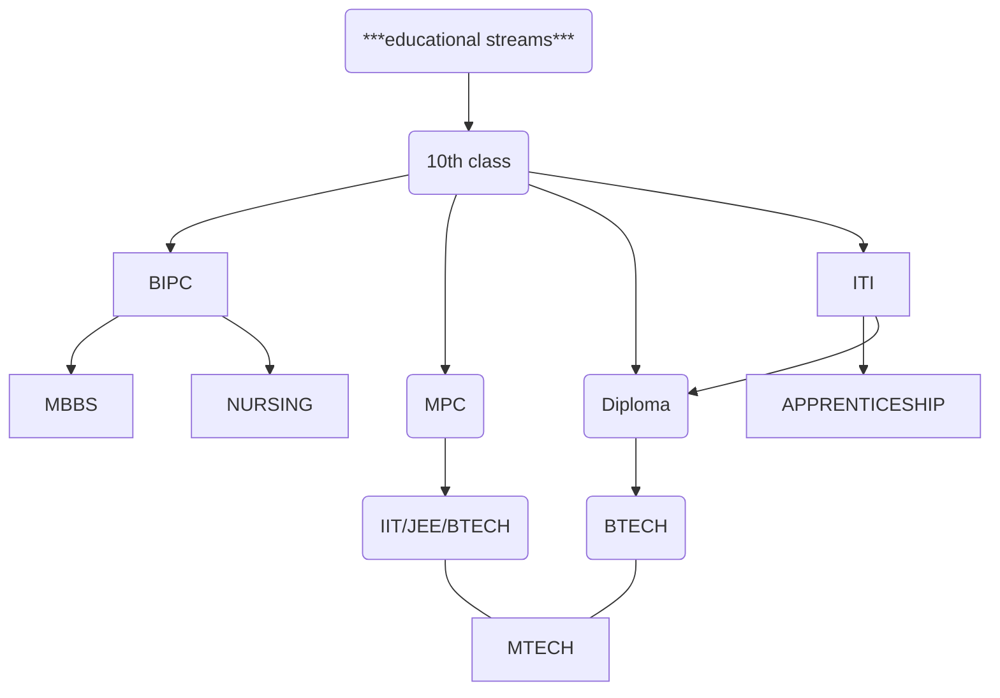
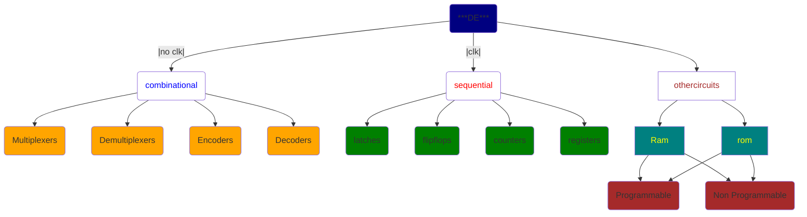
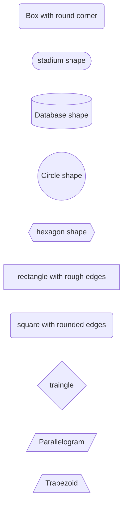
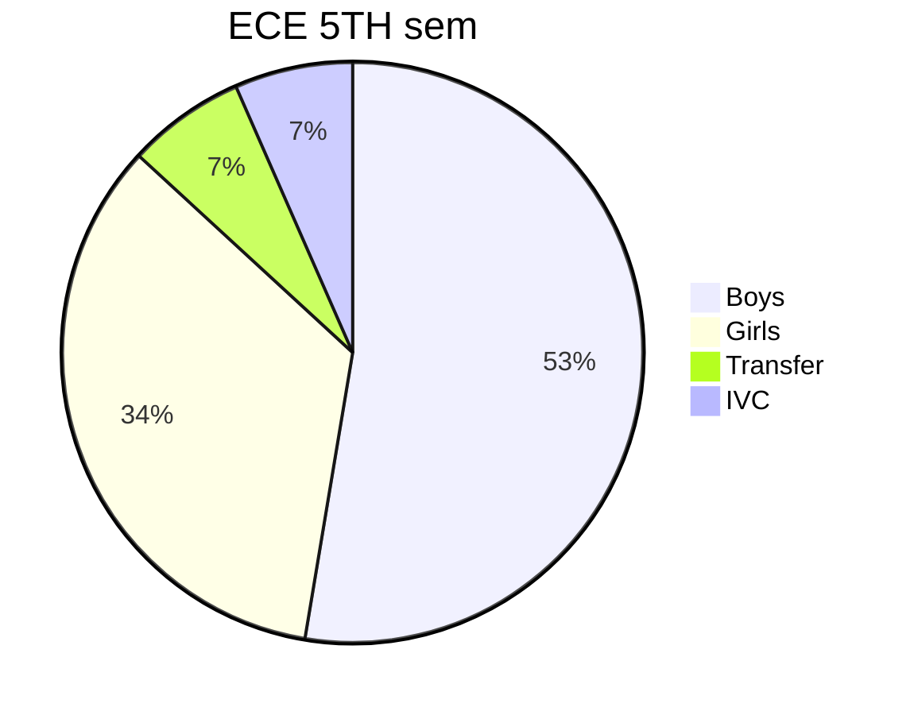

###  flowchart 

### flowchart with basic colours

/// A-->B(combinational) and A-->combinational the output is same  but we are wrapping the word combinational into B for reusubality ,we  can access the combinational by writing B instead of writing combinational again.

///if you want to add colour to a block the syntax is  
style variable/text fill:color name

/// if you want to add color to text and block ,the syntax is   
sytle variable/text fill:color name , color :color name  
ex: style A fill :pink,color:red   
 //here the block will be filled with pink and text with red.  
**use color and not colour** 

///if you want to add colour to multiple blocks,texts or variable we can use class function .The syntax for adding is  
classDef classname  fill:color name  
class variables/text classname   
ex: classDef tarun fill:grey ,color:yellow  
     class a,b,c tarun  
     // here class name is tarun  so in second line we are calling the function class to fill the color whenever class is called with the class name 


### flowchart with different shapes


### piechart

//how is it calculated add the total numbers 40+26+5+5 =76  
boys - (40/76)*100= 53%  
...ivc -(5/76)*100= 7%

### piechart with changing the colours
```mermaid

    title Average Marks per Subject
    "Math" : 77
    "Science" : 74
    "English" : 76

    class "Math" red
    class "Science" green
    class "English" blue

    classDef red fill:red,stroke:black
    classDef green fill:green,stroke:black
    classDef blue fill:blue,stroke:black
```
### bar graph
```mermaid

    title Average Marks per Subject
    x-axis Subject
    y-axis Average Marks

    "Math" : 77
    "Science" : 74
    "English" : 76
```
### equations
$E=mc^2$   

$a^2 +b^2 +c^2$ 

$ \int_a^b f(x) dx $

$\frac{d}{dx}(x)=0$

$\frac{d}{dx}{x^n}=n.x^{n-1}$

$\frac{d}{dx}(x)=1$

$$\frac{d}{dx}(log x)=\frac{1}{x} $$

$$\frac{d}{dx}[f(x)\pm g(x)]= \frac{d}{dx}[f(x)]\pm \frac{d}{dx}[g(x)] $$

$$ \frac{d}{dx}[f(x).g(x)]=f'(x)g(x)+f(x)g'(x)$$

$$f(x)= \frac{1}{\sqrt{2\pi}}e^{-\frac{x^2}{2}}$$
$$e^{i\pi}+1=0$$
$$\int_0^\infty x^2e^{-x}dx=2$$
$$f(x)=\sum_{n=0}^\infty \frac{f(^n)(a)}{n!}(x-a)^n$$
$$x= \frac{-b\pm \sqrt{b^2-4ac}}{2a} $$

## basic wavefrom 
```wavedrom
{ signal: [
  { name: "clk",wave: "p........" },
  { name: "Data",wave: "x.345x|=.x", data: ["head", "body", "tail", "data"] },
  { name: "Request",     wave: "0.1..0|1.0" },
  {},
  { name: "Acknowledge", wave: "1.....|01." }
]}
```

